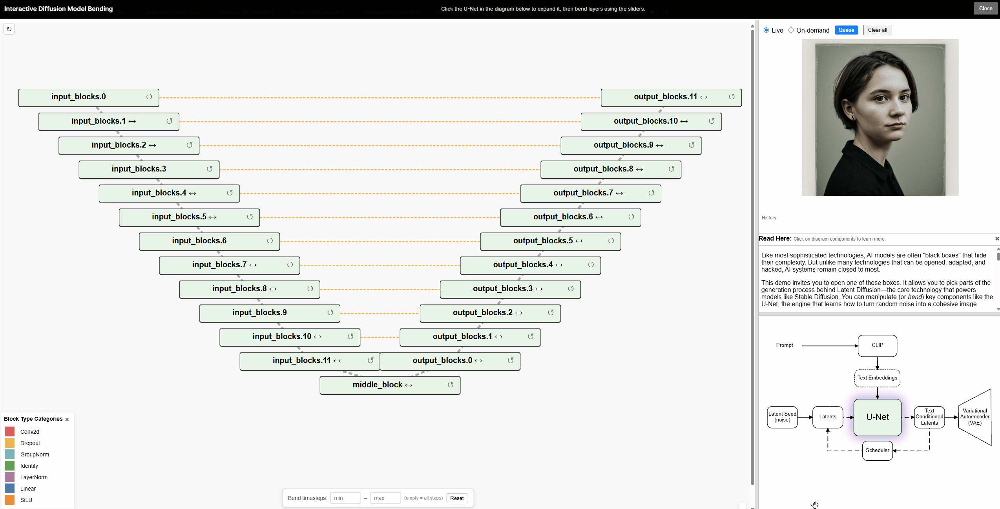

# ComfyUI Model Bending

A ComfyUI custom node that provides **model bending** for diffusion models (e.g. Stable Diffusion, Flux). Model bending is the manipulation of a model's activations at different chosen parts during sampling. It's a low level kind of control, and it is useful for creating experimential variations on an output, or for testing out, breaking, or tinkering with models. Manipulations include include addition, multiplication, noise, rotation, erosion, and dilation, and more. Inspired by [network-bending](https://github.com/terrybroad/network-bending) of GAN models. 

## Showcase
A demo with pre-computed bending results and explainations can be accessed here: [https://diffusion-bending-demo.netlify.app/](https://diffusion-bending-demo.netlify.app/)

An example of rotating the outputs of the realisticvisionv51_v51vae model at its Unet's middle block (middle_block.2.out_layers), doing a full rotation (0-360deg).


Another loop where we inject a scalar value (-10 to 30) to the middle block (middle_block.2.out_layers) of the UNet of the sd_xl_turbo model.


You can also refer to [this document](https://drive.google.com/file/d/1i2DblNXDNYoJou9sKNzwu58-b2s6wASu/view?usp=sharing) which shows a catalog of generated results, sampled  by systmatically bending different layers in one model. The images are sorted top-bottom by the appearance of the neural network layer within the model. Then sorted left to right by the scalar magnitude of how much the activations produced by that layer are multiplied with: 0 (ablation), 0.5, 1 (default, output when no bending is applied), 1.5 and 2.

## Components
This project provides:
1. <mark>NEW</mark> **Interactive Bending Web UI** — Plug-and-play. Simply connect the model to the node then send the model downstream. Visualize the model structure (U-Net / transformer), pick layers, and apply bends from the browser. Copy bends as JSON and paste into the **Apply Bends from JSON** node. [[Workflow](workflows/interactive_bending.json)]



2. **Model Bending (UNet)** — Inject bending modules into your MODEL (UNet). Use **Model Bending** (custom paths) or **Model Bending (SD Layers)** (block + layer). The **Model Inspector** node helps you explore layers. [[Workflow](workflows/basic_unet_bending.json)]
7. <mark>NEW</mark> **LoRA Bending** — Replaces the Load LoRA node. Apply a bending module to LoRA weights. **LoRA Bending** bends every LoRA component (attached matrices) in the model. **LoRA Bending (list)** outputs the list of LoRA matrices in the model for you to pick from. [[Workflow](workflows/lora_bending.json)]
3. **VAE Bending** — Inject bending modules into your VAE (**Model VAE Bending**). [[Workflow](workflows/vae_bending.json)]
4. **Conditionings × Operations** — Apply operations to conditionings (CLIP encodings) to move them in semantic latent space (**ConditioningApplyOperation**). [[Workflow](workflows/conditioning_bending.json)]
5. **CFG step-wise operations** — Apply operations to intermediate latents at a chosen denoising step (**LatentApplyOperationCFGToStep**). Latent operations (multiply, add, threshold, rotate, noise, custom) can be used with conditioning or sampling. [[Workflow](workflows/denoising_step_bending.json)]
6. **Feature map visualization** — **Visualize Feature Map** shows features at a given layer by averaging over channels into image-like tensors.
[Source](https://ravivaishnav20.medium.com/visualizing-feature-maps-using-pytorch-12a48cd1e573)
[[Workflow](workflows/feature_map_viz.json)]


## Quickstart
1. Install [ComfyUI](https://docs.comfy.org/get_started).
2. (For older versions of Comfy, since the Manager is packaged with Comfy now) Install [ComfyUI-Manager](https://github.com/ltdrdata/ComfyUI-Manager) and install this extension from the manager; or clone manually (see below).
3. Restart ComfyUI and refresh your broweser.

## Installation (manual)
1. Clone into ComfyUI custom nodes:
   ```bash
   cd ComfyUI/custom_nodes
   git clone <repository-url> ComfyUI-Web-Bend-Demo
   ```
   Replace `<repository-url>` with the actual repo URL (e.g. your fork or upstream).
2. Restart ComfyUI. The web UI is served at `{ComfyUI_URL}/web_bend_demo/`
   
## Available nodes
| Node name | Category / use |
|-----------|----------------|
| Interactive Bending WebUI | Web UI — connect MODEL, configure bends in browser |
| Apply Bends from JSON | Paste JSON from web UI “Copy Bends” |
| Model Bending | UNet — inject at custom paths |
| Model Bending (SD Layers) | UNet — pick block + layer index |
| Model VAE Bending | VAE |
| Model Inspector | Inspect MODEL structure |
| Model VAE Inspector | Inspect VAE structure |
| Apply To Subset (Bending) | Apply module to random subset (batch/channel/spatial) |
| Add Noise / Add Scalar / Multiply Scalar / Threshold / Rotate / Scale / Erosion / Gradient / Dilation / Sobel Module (Bending) | Bending modules for MODEL or VAE |
| LoRA Bending | Load LoRA by name; bend all its components with a bending module |
| LoRA Bending (list) | Load LoRA by name; bend one component (by index or by key). Outputs: bent key, full key list |
| Visualize Feature Map | Feature map at a layer path |
| LatentApplyOperationCFGToStep | Apply operation at one denoising step |
| Latent Operation (Multiply Scalar, Add Scalar, Threshold, Rotate, Add Noise, Custom) | LATENT / CONDITIONING ops |
| ConditioningApplyOperation | CONDITIONING ops |

## Folder Contents
| Path | Description |
|------|-------------|
| **web/** | Web UI (explorer, config, assets). See [web/README.md](web/README.md) for setup and ViewComfy/local Comfy options. |
| **scripts/** | Experiment runners, export, metrics, and explorer. See [scripts/README.md](scripts/README.md). |
| **nodes.py** | ComfyUI nodes (e.g. `InteractiveBendingWebUI`, `ApplyBendsFromJSON`). |
| **model_bending_nodes.py** | Standalone bending nodes (inspector, VAE bending, latent/conditioning ops). |
| **bendutils.py** | Bending and graph utilities. |

## Notes
This is an ongoing project. Issues and feature requests are welcome (e.g. via GitHub issues as applicable).
## Supported Models
In theory, most of the nodes should work with any model because bending only needs an address/path in the model and that can vary from one model to another. However the Interactive Bending node is currently supported and tested out for Stable Diffusion and Flux variants. 

## License
See [web/LICENSE](web/LICENSE) for license information.
