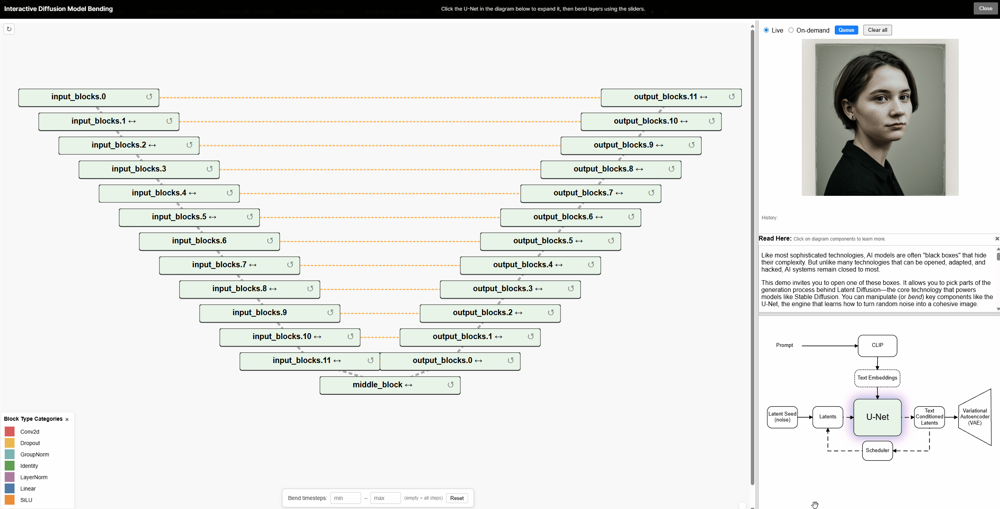

# ComfyUI Model Bending

A ComfyUI custom node pack for **model bending** of diffusion models (Stable Diffusion, SDXL, Flux, SD3, and experimentally WAN video models). Model bending manipulates a model's activations at chosen places while it samples. It is a low-level kind of control, useful for creating experimental variations of an output, and for testing, breaking, tinkering with, or explaining models. Manipulations include addition, multiplication, noise, rotation, scaling, translation, flipping, blurring, sharpening, erosion, dilation, and more. Inspired by [network-bending](https://github.com/terrybroad/network-bending) of GAN models.

## Showcase
A demo with pre-computed bending results and explanations: [https://diffusion-bending-demo.netlify.app/](https://diffusion-bending-demo.netlify.app/)

Rotating the outputs of the realisticvisionv51_v51vae model at its UNet's middle block (`middle_block.2.out_layers`), through a full rotation (0–360°):


Adding a scalar (-10 to 30) to the same middle block (`middle_block.2.out_layers`) of the sd_xl_turbo UNet:


[This document](https://drive.google.com/file/d/1i2DblNXDNYoJou9sKNzwu58-b2s6wASu/view?usp=sharing) shows a catalogue of results made by systematically bending different layers of one model. Rows follow the order of the layers in the network; columns are the factor the layer's activations are multiplied by: 0 (ablation), 0.5, 1 (unbent), 1.5 and 2.

## Components
1. **Interactive Bending Web UI** — Plug-and-play: connect a model to the node and send it downstream. See the model structure (U-Net / transformer), pick layers, and apply bends from the browser. Copy the bends as JSON and paste them into **Apply Bends from JSON**. [[Workflow](workflows/interactive_bending.json)]

   

2. **Model Bending** — Inject bending modules into the diffusion model at any layer path (**Model Bending**), by UNet block and layer (**Model Bending (SD Layers)**, **Model Bending (SD Blocks)**), or per transformer block (**DiT Block Bending**). **Model Inspector** and **Bendable Layer Catalogue** help you find layers, and **Timestep Gated Bending** limits a bend to a window of diffusion time. [[Workflow](workflows/basic_unet_bending.json)] [[Advanced](workflows/advanced_unet_bending.json)] [[Fine control](workflows/fine_control_unet_bending.json)]
3. **LoRA Bending** — Replaces the Load LoRA node and applies a bending module to LoRA weights. **LoRA Bending** bends every LoRA component in the model; **LoRA Bending (list)** lists the LoRA matrices so you can pick one. [[Workflow](workflows/lora_bending.json)]
4. **VAE Bending** — Inject bending modules into your VAE (**Model VAE Bending**). [[Workflow](workflows/vae_bending.json)]
5. **Conditionings × Operations** — Apply operations to conditionings (text encodings) to move them in semantic latent space (**ConditioningApplyOperation**). [[Workflow](workflows/conditioning_bending.json)]
6. **CFG step-wise operations** — Apply operations to intermediate latents at a chosen denoising step (**LatentApplyOperationCFGToStep**). Latent operations (multiply, add, threshold, rotate, noise, custom) work with conditioning or sampling. [[Workflow](workflows/denoising_step_bending.json)]
7. **Feature map visualization** — **Visualize Feature Map** shows the features at a layer, averaged over channels into images (every frame for video models). [[Workflow](workflows/feature_map_viz.json)] ([background](https://ravivaishnav20.medium.com/visualizing-feature-maps-using-pytorch-12a48cd1e573))
8. **H-space bending** — **Compute PCA** and **HSpace Bending** move the UNet's middle-block activations along principal components. [[Workflow](workflows/PCA_HSpace_bending.json)]
9. <mark>EXPERIMENTAL</mark> **Activation probes and steering vectors** — Record per-layer activation statistics while sampling, compare against an unbent run, and turn the difference between two prompts into a steering direction. [[Workflow](workflows/activation_probe_steering.json)]
10. <mark>EXPERIMENTAL</mark> **Video model bending (WAN 2.1 / 2.2)** — Bend the attention maps of video diffusion transformers, frame by frame or over time. See [below](#experimental-video-model-bending-wan-21--22).

## Quickstart
1. Install [ComfyUI](https://docs.comfy.org/get_started).
2. Install **ComfyUI Model Bending** from the ComfyUI Manager (built into recent ComfyUI versions; for older versions install [ComfyUI-Manager](https://github.com/ltdrdata/ComfyUI-Manager)), or clone it manually (see below).
3. Restart ComfyUI and refresh your browser.

## Installation (manual)
1. Clone into ComfyUI's custom nodes folder and install the dependencies (`kornia`, `scikit-learn`) with ComfyUI's Python:
   ```bash
   cd ComfyUI/custom_nodes
   git clone https://github.com/abuzreq/ComfyUI-Model-Bending
   pip install -r ComfyUI-Model-Bending/requirements.txt
   ```
   For the Windows portable build, use `python_embeded/python.exe -m pip install -r ...` instead of `pip`.
2. Restart ComfyUI. The web UI is served at `{ComfyUI_URL}/web_bend_demo/`.

## Available nodes
| Node name | Category / use |
|-----------|----------------|
| Interactive Bending WebUI | Web UI — connect a MODEL and configure bends in the browser |
| Apply Bends from JSON | Apply the JSON from the web UI's "Copy Bends" (format: [docs/bends-json.md](docs/bends-json.md)) |
| Model Bending | Inject a bending module at one or more layer paths, with step and diffusion-time windows |
| Model Bending (SD Layers) / Model Bending (SD Blocks) | UNet — pick block and layer index / whole blocks |
| DiT Block Bending | Bend transformer blocks (`double:0-6, single:25-37`) of Flux, SD3, WAN, Qwen-Image, LTX, HunyuanVideo, …; image and text streams separately, spatial ops on the real image (or video) grid |
| Timestep Gated Bending | Limit any bending module to a window of diffusion time t (1 = noise, 0 = image), with optional ramps |
| Model VAE Bending | VAE |
| Model Inspector / Model VAE Inspector | Inspect the MODEL / VAE structure |
| Bendable Layer Catalogue | JSON list of layer paths, marking which can be bent and how |
| Add Noise / Add Scalar / Multiply Scalar / Threshold / Rotate / Scale / Translate / Flip / Gaussian Blur / Sharpen / Erosion / Gradient / Dilation / Sobel / Fourier Amplify Module (Bending) | Bending modules for MODEL or VAE |
| Apply To Subset (Bending) | Apply a module to a random subset (batch / channel / spatial) |
| LoRA Bending | Load a LoRA by name; bend all its components with a bending module |
| LoRA Bending (list) | Load a LoRA by name; bend one component (by index or by key). Outputs: bent key, full key list |
| Visualize Feature Map | Feature map at a layer path |
| Compute PCA / HSpace Bending | Bend the UNet's middle block along principal components |
| LatentApplyOperationCFGToStep | Apply an operation at one denoising step |
| Latent Operation (Multiply Scalar, Add Scalar, Threshold, Rotate, Add Noise, Custom) / Latent Operation To Module | LATENT / CONDITIONING ops, and their use as bending modules |
| ConditioningApplyOperation | CONDITIONING ops |
| NoiseVariations | Add scaled random noise to a latent |
| Activation Probe / Read Activation Probe | *Experimental.* Per-layer activation statistics for every step, as a heat map + JSON report; compare against an unbent run to see how a bend propagates |
| Steering Vector (from Activations) / Apply Steering Vector | *Experimental.* Turn the activation difference between two prompts into a direction you can add to any prompt |
| Attention Map Bending, Attention Map Capture, Read Attention Maps | *Experimental.* Video attention bending and inspection (see below) |
| Frame Ramp / Temporal Shift / Temporal Blur / Frame Reverse (Bending) | *Experimental.* Temporal bending modules for video models |

Bending notes:
- Paths to containers the model never calls directly (e.g. `middle_block`, `output_blocks.4`) are bent at their last child; lists (`input_blocks`) are skipped with a warning. All messages are logged with the `[model-bending]` prefix; set `strict` to turn them into errors.
- `Model Bending` accepts a diffusion-time window (`t_start`/`t_end`), which follows the noise level regardless of steps, scheduler or shift.
- Rotate, Scale and Translate have a `padding` option: `zeros`, `border` (repeat the edge) or `reflection`.
- The bends JSON (version 1.1, documented in [docs/bends-json.md](docs/bends-json.md)) only adds optional keys to the web UI format, so v1 JSON works unchanged. Older plugin versions ignore the new keys (bending at all steps, without guards), log a warning for wildcard paths and reject the newer ops; they never skip a bend silently. Per bend: `"t": [hi, lo]`, `"steps": "0-4,9"`, `"blend": 0..1`, `"label"`, `"guard": {"nan": "zero|clamp|none", "max_std_ratio": 8, "preserve_norm": true}`, and `"module_type": "subset"` or `"frame_ramp"` with an `"inner"` op. Paths accept wildcards per segment (`output_blocks.*.1`, `input_blocks.[4-8].0`).
- `Apply Bends from JSON` replaces `{{a}}`…`{{d}}` with its optional inputs, warns about unknown keys and arguments (e.g. a misspelled `scaler`), can clamp arguments (`hard`: each op's limits, `safe`: narrowed by a `safe_ranges` JSON, optionally per path glob), and outputs a `report` and a `resolved_json` with every layer and argument made explicit. Bends on the same layer apply last-to-first.

## Experimental: video model bending (WAN 2.1 / 2.2)
> Marked **Experimental** in ComfyUI: tested on tiny random-weight WAN models (`tests/test_video.py`), not yet on real WAN weights. Please report what you see.

**Attention Map Bending** bends the cross-attention maps between the video and the prompt (or the CLIP image in WAN 2.1 I2V) frame by frame, with any bending module. It can also bend self-attention: where each position's result lands (`self_query`) or where it reads from (`self_key`). You can target blocks, prompt tokens or words, heads, latent frames, steps and CFG passes. **Attention Map Capture** and **Read Attention Maps** render where chosen words are attended to, as video. **Frame Ramp**, **Temporal Shift**, **Temporal Blur** and **Frame Reverse** bend over time.

Tips: the middle blocks (13–18 of 30 in WAN 2.1 1.3B, ~17–24 of 40 in 14B) and the early steps change the most; `tokens: all` is much stronger than a single word; keep scales small (~1.04); amplify (Multiply Scalar) needs `renormalize: none`. WAN 2.2 14B has two models: bend each separately (the high-noise one for layout). Cross-attention bending computes the map explicitly, so bend a few blocks and steps at high resolution.

Workflows ([workflows/video/](workflows/video/), with model download links in each):
[attention bending](workflows/video/wan21_t2v_attention_bending.json) ·
[attention capture](workflows/video/wan21_t2v_attention_capture.json) ·
[texture ops](workflows/video/wan21_t2v_texture_ops.json) ·
[temporal bending](workflows/video/wan21_t2v_temporal_bending.json) ·
[self-attention](workflows/video/wan21_t2v_self_attention_bending.json) ·
[DiT blocks / layers](workflows/video/wan21_t2v_dit_block_bending.json) ·
[image-to-video](workflows/video/wan21_i2v_attention_bending.json) ·
[WAN 2.2 14B](workflows/video/wan22_t2v_14b_attention_bending.json)

## Supported models
Most nodes work with any model, because bending only needs a path to a layer, and paths differ from one model to another (use **Model Inspector** or **Bendable Layer Catalogue** to find them). The Interactive Bending Web UI is tested with Stable Diffusion and Flux variants. DiT Block Bending covers most transformer models in ComfyUI. The attention-map nodes support the WAN family (2.1 / 2.2, text- and image-to-video) and are experimental.

## Folder contents
| Path | Description |
|------|-------------|
| **web/** | Web UI (explorer, config, assets). See [web/README.md](web/README.md) for setup and ViewComfy/local Comfy options. |
| **scripts/** | Experiment runners, export, metrics, and explorer. See [scripts/README.md](scripts/README.md). |
| **workflows/** | Example workflows; video workflows in **workflows/video/**. |
| **docs/** | [Bends JSON format](docs/bends-json.md) and images. |
| **nodes.py** | Web UI and JSON nodes (`InteractiveBendingWebUI`, `ApplyBendsFromJSON`) and the bends JSON reader. |
| **model_bending_nodes.py** | Standalone bending nodes (model / block / VAE / LoRA bending, inspectors, latent and conditioning ops). |
| **bending_modules.py** | The bending operations (rotate, scale, translate, blur, temporal ops, …). |
| **bendutils.py** | Bending and graph utilities, including the shared hook engine and the DiT token-grid helpers. |
| **attention_bending.py** | Attention map bending and capture for video DiTs (experimental). |
| **probe.py** / **probe_nodes.py** | Activation probe and steering-vector core (reusable by the web UI) and its nodes. |
| **tests/** | CPU tests with tiny random models, run with ComfyUI's Python: `tests/test_hooks.py`, `tests/test_video.py` (e.g. `python_embeded/python.exe ComfyUI/custom_nodes/ComfyUI-Model-Bending/tests/test_video.py`); web UI bend store: `node tests/test_web_bend_store.js`; video workflow generator and checker: `tests/make_video_workflows.py` (needs a running ComfyUI). |

## Notes
This is an ongoing project. Issues and feature requests are welcome on [GitHub](https://github.com/abuzreq/ComfyUI-Model-Bending/issues).

## License
MIT — see [LICENSE](LICENSE).
